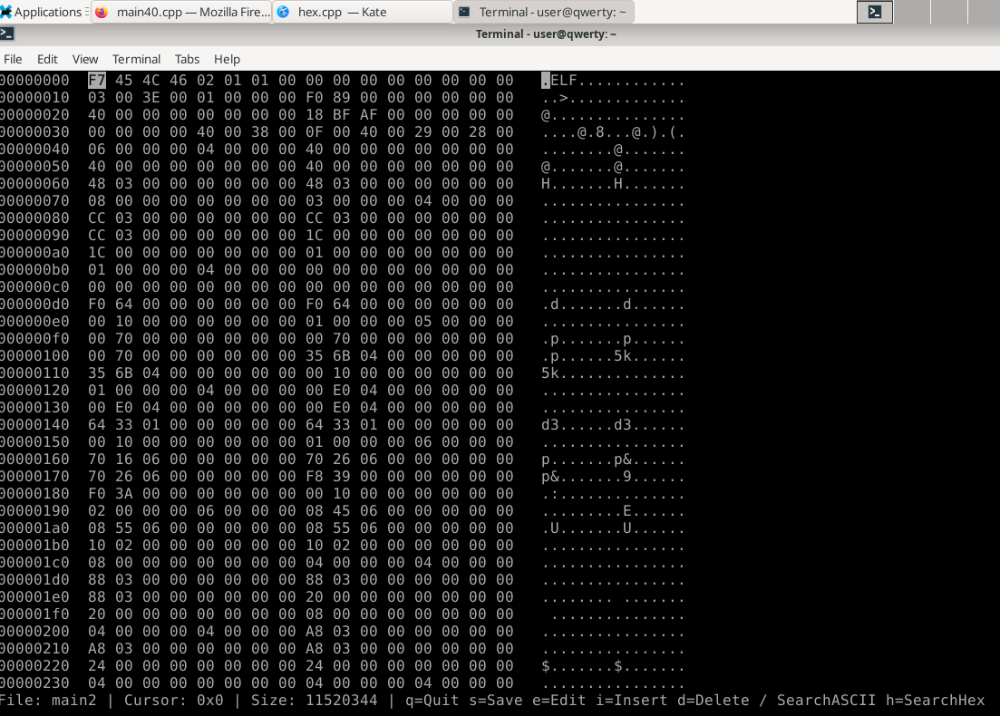

# 0verhex
ncurses hex editor made for having fun

# Compile

```bash
make -j8  # 8 cores/threads to use in parallel compile
sudo/doas make install
```

# Requirements

In Debian it's `sudo apt install libncurses5-dev libncursesw5-dev `, in your other OS's search for `lib ncurses`.

### To-do:

1. `Completed. But still needs some testing.` ~Add undo/redo functions and don't store the entire file many times for undo/redo, but only the parts that was exchanged.~

### Disassembly using capstone

```cpp
// sudo apt install libcapstone-dev
// When compiling pass -lcapstone

#include <iostream>
#include <fstream>
#include <iomanip>
#include <vector>
#include <cstdlib>
#include <stdexcept>
#include <capstone/capstone.h> // Requires Capstone library

// Function to read a binary file into a vector
std::vector<uint8_t> readBinaryFile(const std::string &filename) {
    std::ifstream file(filename, std::ios::binary);
    if (!file) throw std::runtime_error("Error: Cannot open file " + filename);
    return std::vector<uint8_t>((std::istreambuf_iterator<char>(file)), std::istreambuf_iterator<char>());
}

// Function to disassemble using Capstone
void disassemble(const std::vector<uint8_t> &data, uint64_t startAddr = 0x1000) {
    csh handle;
    cs_insn *insn;
    size_t count;
    if (cs_open(CS_ARCH_X86, CS_MODE_32, &handle) != CS_ERR_OK)
        throw std::runtime_error("Failed to initialize Capstone");
    count = cs_disasm(handle, data.data(), data.size(), startAddr, 0, &insn);
    if (count > 0) {
        for (size_t i = 0; i < count; i++) {
            std::cout << "0x" << std::hex << insn[i].address << ":\t" << insn[i].mnemonic << "\t" << insn[i].op_str << "\n";
        }
        cs_free(insn, count);
    } else {
        std::cerr << "ERROR: Failed to disassemble code!\n";
    }

    cs_close(&handle);
}

int main(int argc, char *argv[]) {
    if (argc != 2) {
        std::cerr << "Usage: " << argv[0] << " <binary_file>\n";
        return EXIT_FAILURE;
    }
    try {
        auto data = readBinaryFile(argv[1]);
        disassemble(data);
    }
    catch (const std::exception &e) {
        std::cerr << e.what() << "\n";
        return EXIT_FAILURE;
    }
    return EXIT_SUCCESS;
}
```
